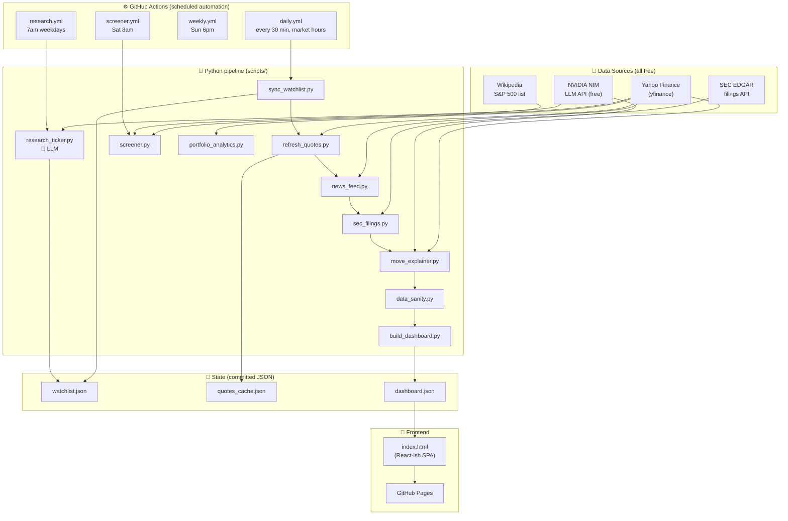
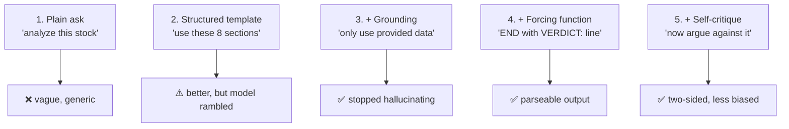
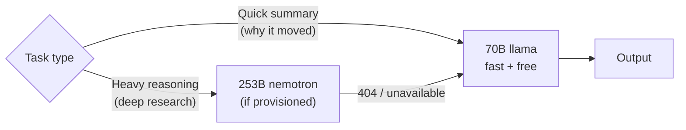

# TickRun Architecture — and the AI concepts behind it

This doc has two jobs:
1. Show how the whole system fits together.
2. **Teach the AI/LLM patterns you built** — because every one of them is a
   technique used in real production AI systems. Each section maps a concept
   to the exact file where it lives.

---

## 1. The big picture

**The core idea:** there is no server. GitHub Actions runs Python on a schedule,
the scripts fetch data + call the LLM, everything is written to JSON committed
back to the repo, and a static HTML page reads that JSON. Zero hosting cost.

---

## 2. The AI heart: Retrieval-Augmented Generation (RAG)

This is the most important AI concept in the project. **A raw LLM hallucinates
facts.** RAG fixes that by *retrieving real data first, then asking the LLM to
reason over it* — never from memory alone.

```mermaid
flowchart LR
    Q["yfinance<br/>fundamentals"] --> CTX
    N["yfinance<br/>news headlines"] --> CTX
    CTX["📋 Build grounded context<br/>(real facts only)"] --> PROMPT
    PROMPT["Prompt with<br/>grounding rules"] --> LLM["🧠 LLM<br/>(NVIDIA NIM)"]
    LLM --> PARSE["Parse: VERDICT +<br/>CONFIDENCE + bear case"]
    PARSE --> WL["watchlist.json"]

    style CTX fill:#1a3a2a
    style PROMPT fill:#2a2a4a
```

**Where:** `scripts/research_ticker.py` → `_build_prompt()`

The lesson: an LLM is a *reasoning engine*, not a *knowledge base*. You feed it
the facts (retrieval) and it does the analysis (generation). When MSFT research
cites "the Three Mile Island restart," that came from a **real headline we
retrieved**, not the model's training data.

---

## 3. AI techniques you used (and what they're called)

| What you built | The real-world AI term | File |
|----------------|------------------------|------|
| Feed real news + fundamentals into the prompt | **RAG / grounding** | `research_ticker.py` |
| "If not in the data, say 'unverified'" | **Anti-hallucination / guardrail prompting** | `prompts/stock_research.md` |
| "End with `VERDICT:` and `CONFIDENCE:`" | **Structured output / forcing function** | `prompts/stock_research.md` |
| Regex to pull the verdict back out | **Output parsing / extraction** | `research_ticker.py` `_extract_verdict()` |
| Try 253B → fall back to 70B | **Model fallback chain / graceful degradation** | `research_ticker.py` `_call_llm()` |
| Second pass argues *against* the buy | **Adversarial / self-critique (multi-pass)** | `research_ticker.py` `_bear_check()` |
| One-sentence "why it moved" from headlines | **Summarization, tightly scoped** | `move_explainer.py` |
| HIGH/MED/LOW self-rating | **Confidence calibration** | `prompts/stock_research.md` |
| "detailed thinking off" system message | **System-prompt steering** | `research_ticker.py` |
| Catch impossible P/E before trusting it | **Input validation (defends the AI from bad data)** | `data_sanity.py` |

---

## 4. The prompt engineering ladder

Your research prompt evolved through the exact stages real prompt engineers go
through. This is worth internalizing:

**The meta-lesson:** you rarely get the prompt right on attempt 1. You add
constraints as you discover failure modes. We literally watched the 253B model
write beautiful prose with *no verdict* — and fixed it by forcing a final
`VERDICT:` line. That debugging loop **is** prompt engineering.

---

## 5. Why "grounding" matters — the trust chain

The thing you kept asking ("can I trust this?") has a precise engineering answer:
**trust flows from grounding.** Here's the hierarchy you built:

```mermaid
flowchart TD
    A["Deterministic checks<br/>(price vs 52w range, P/E sanity)"] -->|"100% trustworthy"| TRUST
    B["LLM reasoning over<br/>provided numbers"] -->|"reliable"| TRUST
    C["LLM summarizing<br/>retrieved news"] -->|"reliable, grounded"| TRUST
    D["LLM facts from<br/>training memory"] -->|"⚠️ verify"| TRUST
    TRUST["🎯 Your decision"]

    style A fill:#0a3a1a
    style B fill:#1a3a2a
    style C fill:#2a3a1a
    style D fill:#3a2a0a
```

The deterministic layer (`data_sanity.py`) needs zero trust — it's just math.
The LLM layers are trustworthy *to the degree they're grounded*. The confidence
tag and bear-case check exist to make the remaining uncertainty **visible**
rather than hidden.

---

## 6. Cost & model strategy (a real production concern)

You learned this firsthand: the heavy model isn't always available on a free
tier, so you **degrade gracefully** to a smaller one. Real AI systems route by
task — expensive models for hard problems, cheap fast ones for simple summaries.
That's `NVIDIA_MODEL_CHAIN` in `research_ticker.py`.

---

## 7. Where to go next (to learn more AI)

If you want to push the AI side further, in rough order of learning value:

1. **Embeddings + semantic search** — instead of keyword news matching, embed
   headlines and find the *most relevant* ones per ticker. (Concept: vector search.)
2. **Few-shot prompting** — give the model 2-3 example verdicts so it matches your
   style more closely. (Concept: in-context learning.)
3. **Evaluation harness** — score the LLM's verdicts against what actually happened
   (you already started this with `track_record.py`). (Concept: model eval.)
4. **Agentic loop** — let the model decide *which* tool to call (fetch news? pull
   the 10-K? check insider trades?) instead of a fixed pipeline. (Concept: tool-use agents.)

Each of these is a step deeper into how modern AI systems are actually built.

---

> Built as a learning project. Every AI pattern here — RAG, grounding, structured
> output, fallback chains, self-critique — is something you'll see in real
> production LLM systems. You didn't just use AI; you built the scaffolding that
> makes AI trustworthy.
